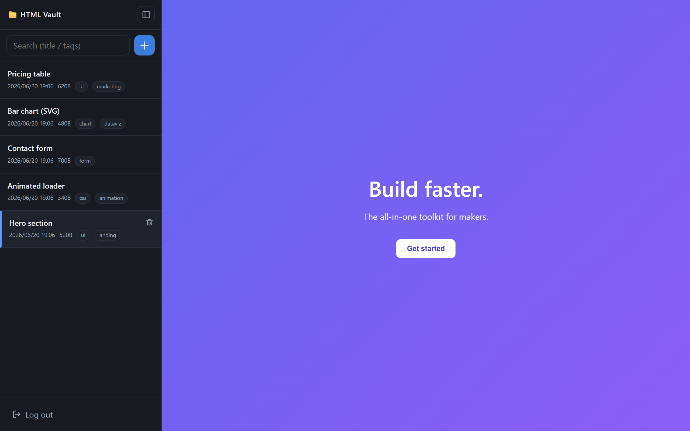

# HTML Vault

[English](README.md) | **日本語**

生成済み HTML スニペットを保存し、安全に（sandbox iframe で）プレビューできる、パスワード認証付きのセルフホスト Web アプリ。同じ Docker イメージが VPS / Fly.io / Render / 自宅サーバー・Raspberry Pi で動きます。



## クイックスタート

```bash
cp .env.example .env        # SESSION_SECRET を設定（推奨）
docker compose up -d
docker compose logs         # 初期パスワードが一度だけ表示される（AUTH_PASSWORD 未設定時）
```

**http://localhost:3000** を開いてログイン。パスワード変更は `docker compose exec html-vault node setpass.js`。

## 表示言語（ビルド時）

UI とサーバメッセージはビルド時に焼き込まれます（ランタイム切替なし）。`APP_LANG`（`en`/`ja`、既定 `en`）で選択：

- **Docker**: `.env` に設定して `docker compose up -d --build`
- **Node**: `APP_LANG=ja npm start`

文言は [`locales/`](locales) にあります。ロケールファイルをコピーして翻訳すれば言語を追加できます。

## 環境変数

| 変数 | 既定 | 説明 |
|------|------|------|
| `PORT` | `3000` | ホスト公開ポート（コンテナ内は 3000 固定）。素の Node では待受ポート |
| `HOST` | `0.0.0.0` / `127.0.0.1`（Node） | 待受アドレス |
| `SESSION_SECRET` | 毎回ランダム | セッション署名鍵。本番は固定値推奨（`openssl rand -hex 32`） |
| `BEHIND_HTTPS` | `0` | TLS 終端プロキシ背後なら `1`（Secure Cookie 有効化） |
| `DATA_DIR` | `/data` / `./data`（Node） | データ保存先 |
| `MAX_UPLOAD_MB` | `10` | HTML 最大サイズ(MB) |
| `AUTH_PASSWORD` | 初回ランダム | `auth.json` 生成までのみ使用 |
| `APP_LANG` | `en` | UI/メッセージ言語（`en`/`ja`）。ビルド時に適用 |

## デプロイ

- **VPS / 自宅 / Raspberry Pi**: `docker compose up -d`。公開時は HTTPS 必須（セキュリティ参照）。詳細: [deploy/DEPLOY.ja.md](deploy/DEPLOY.ja.md)。Cloudflare Tunnel: [deploy/CLOUDFLARE.ja.md](deploy/CLOUDFLARE.ja.md)。
- **公開イメージ**: `ghcr.io/uzuradev/html-vault:latest`（`docker-compose.yml` の `build:` を `image:` に置換）。
- **Fly.io**: `fly.toml` 同梱 — `fly launch --no-deploy`、ボリューム作成、`SESSION_SECRET` 設定、`fly deploy`。
- **Render**: `render.yaml` 同梱（永続ディスクは有料インスタンスが必要）。

## セキュリティ

| 脅威 | 対策 |
|------|------|
| 他人のアクセス | ログイン必須・bcrypt・レート制限（15分10回） |
| 保存HTMLのXSS | `sandbox` iframe（`allow-same-origin` なし）で隔離。ソースは `text/plain` |
| セッション奪取 | HttpOnly / SameSite=Strict /（HTTPS時）Secure Cookie |
| CSRF | 変更系APIにダブルサブミットトークン |
| パストラバーサル | サーバー採番・16進32文字のみ |
| ヘッダ | helmet の CSP / X-Frame-Options |

公開時は HTTPS と固定 `SESSION_SECRET` を。必要なら前段に Basic 認証 / Cloudflare Access を追加。

注意: 初期パスワードはログに一度表示されます（避けるなら `AUTH_PASSWORD` 設定）。プレビュー先からの外向き通信（外部画像/スクリプト/フォーム）は可能なので、信頼できない HTML を開くなら CSP で制限を。

## バックアップ

データはすべて `data/`。アーカイブするだけ：

```bash
tar czf html-vault-backup-$(date +%F).tar.gz data/
```

## Roadmap

- 本文の全文検索（現在はタイトル/タグのみ）
- セッション永続化（現在は再起動で再ログイン。データは保持）
- MCP 連携、スニペットのエクスポート/インポート

## コントリビュート / ライセンス

[CONTRIBUTING.ja.md](CONTRIBUTING.ja.md)（[English](CONTRIBUTING.md)）· [MIT](LICENSE)
