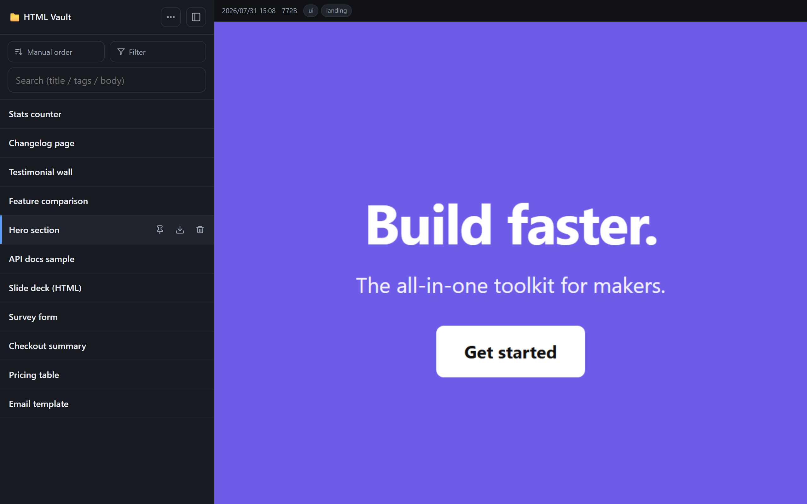

# HTML Vault

**English** | [日本語](README.ja.md)

Don't open AI-generated HTML straight in your browser. HTML Vault is a password-protected vault that stores your HTML snippets and previews them in an isolated `sandbox` iframe — every snippet is treated as untrusted by default. Deploy it to Cloudflare Workers in minutes, or self-host the Docker image.

It's aimed at people who generate HTML with LLMs (Claude / ChatGPT artifacts, AI explainers, dashboards) and want to store and safely preview those snippets on their own infrastructure instead of pasting them into third-party online tools. This is an early solo OSS project — feedback and issues are welcome.

> 💡 **[Live demo](https://html-vault-demo.uzuradev.workers.dev)** (read-only) — browse real AI-generated snippets in the sandboxed viewer. And with [MCP integration](#mcp-integration-headless-upload), Claude can upload generated HTML into your vault mid-conversation — no manual save/upload.



## ⚡ Quick start — Cloudflare Workers (recommended)

Runs on the Workers free tier: no server to maintain, always on.

[](https://deploy.workers.cloudflare.com/?url=https://github.com/uzuraDev/html-vault/tree/main/worker)

Or set it up manually:

```bash
git clone https://github.com/uzuraDev/html-vault.git && cd html-vault/worker
npm install
npx wrangler login
npx wrangler kv namespace create VAULT   # paste the printed id into wrangler.toml
npm run setpass                          # login password (stores a PBKDF2 hash as the AUTH_HASH Secret)
npx wrangler secret put SESSION_SECRET   # a value generated with e.g. openssl rand -hex 32
npm run deploy
```

> On the first `setpass` / `secret put`, the Worker does not exist yet, so wrangler asks whether to create a new (draft) Worker — answer yes and continue.

Your vault is live at `https://html-vault.<your-subdomain>.workers.dev`. Details: [worker/README.md](worker/README.md).

### Secrets / Vars

Secrets are set with `npx wrangler secret put <NAME>` (run inside `worker/`); Vars go in `wrangler.toml`.

| Name | Kind | Required | Description |
|------|------|------|------|
| `AUTH_HASH` | Secret | yes | PBKDF2 hash of the login password. Set via `npm run setpass` |
| `SESSION_SECRET` | Secret | yes | HMAC key for session cookies (`openssl rand -hex 32`) |
| `API_TOKEN` | Secret | no | Bearer token for headless API access. Powers the [stdio MCP server](#mcp-integration-headless-upload) |
| `MCP_SECRET_PATH` | Secret | no | Enables the remote MCP endpoint `/mcp/<MCP_SECRET_PATH>` (404 when unset). Generate with `openssl rand -hex 24` |
| `SECURITY_CONTACT` | Secret | no | Contact served at `/.well-known/security.txt` (404 when unset) |
| `DEMO_MODE` | Var | no | `"1"` turns the deployment into a public read-only demo |

A custom domain is optional — add one from the Cloudflare dashboard (your Worker → Domains & Routes). The default `*.workers.dev` URL works as is.

Want your own public read-only demo? Set `DEMO_MODE = "1"`: reads become public, every write returns 403. **Only enable it on a dedicated demo KV namespace** (seed one with [`worker/scripts/seed-demo.mjs`](worker/scripts/seed-demo.mjs)) — DEMO_MODE exposes every snippet in the bound namespace without login, so never set it on your real vault.

## MCP integration (headless upload)

Save model-generated HTML straight into the vault during a conversation. There are two paths depending on the client — section B (the built-in remote MCP, recommended for most users) comes first on purpose; section A (stdio, for local clients) follows.

### B. claude.ai / mobile app — built-in remote MCP (recommended)

Register the vault as a **custom connector** in claude.ai, and Claude (web app or **mobile**) can save the HTML it generates via the `upload_html` tool. No separate MCP process is needed — the server itself serves `/mcp/<MCP_SECRET_PATH>`.

- **Transport**: Streamable HTTP / stateless (JSON responses, no extra dependencies)
- **Tools**: `upload_html` (write) / `list_snippets` (read)
- **Auth**: authless + secret path. `/mcp` returns 404 whenever `MCP_SECRET_PATH` is unset.

Setup:

1. **Make the server publicly reachable over HTTPS** (required — claude.ai connects from Anthropic's cloud, so `localhost` / LAN / VPN-only servers won't work). **On Workers this is already done**: the `*.workers.dev` URL is public HTTPS out of the box. On Docker, put the server behind a reverse proxy + domain + TLS, or a Cloudflare Tunnel (see [deploy/](deploy)).
2. Generate a secret string (`openssl rand -hex 24`) and set it as `MCP_SECRET_PATH` — Workers: `npx wrangler secret put MCP_SECRET_PATH`; Docker: add it to `.env` and restart.
3. In claude.ai → Customize > Connectors → **Add custom connector**, paste the URL:
   ```
   https://<your-worker>.<your-subdomain>.workers.dev/mcp/<MCP_SECRET_PATH>
   ```
   (For Docker, use your own domain instead.) No OAuth fields needed (authless). Registering on web/desktop syncs to the mobile app.
4. Ask Claude to "save this HTML to the vault." Set `upload_html` to "Allow always" to make it near-automatic.

Quick check:
```bash
curl -s -X POST https://<your-worker>.<your-subdomain>.workers.dev/mcp/<MCP_SECRET_PATH> \
  -H 'Content-Type: application/json' \
  -d '{"jsonrpc":"2.0","id":1,"method":"tools/list"}'
```
(Docker: replace the URL with `http://localhost:3000/mcp/<MCP_SECRET_PATH>` or your own domain.)

> ⚠️ **A secret URL is not authentication.** Anyone with the URL can write. Avoid sharing/screenshotting/logging it, and rotate by changing `MCP_SECRET_PATH`. For stronger protection, add a front gate (OAuth / Cloudflare Access).

### A. Local MCP clients (e.g. Claude Code) — stdio MCP

1. Set an `API_TOKEN` on the vault (e.g. `openssl rand -hex 32`) — Workers: `npx wrangler secret put API_TOKEN`; Docker: `.env` + restart. With a token set, `POST /api/snippets` and `GET /api/snippets` also accept `Authorization: Bearer <API_TOKEN>` — no login/CSRF needed for those. Leave `API_TOKEN` unset to disable token auth (default).
2. Run the bundled MCP server in [`mcp/`](mcp) and register it with your client. See [mcp/README.md](mcp/README.md) for the `.mcp.json` example and the `upload_html` / `list_snippets` tools.

The token is a write credential — keep it secret, prefer HTTPS, and rotate it by changing `API_TOKEN`. Token requests skip CSRF (a `Bearer` header isn't auto-attached by browsers, so it isn't a CSRF vector); the cookie/session flow still enforces CSRF.

## Security

Both implementations share the same core protections:

| Threat | Mitigation (both implementations) |
|------|------|
| XSS from stored HTML | Preview in `sandbox` iframe (no `allow-same-origin`); direct access to the raw HTML also gets a `Content-Security-Policy: sandbox` header; source served as `text/plain` |
| Unauthorized access | Login required; login rate limit (10 / 15 min) |
| CSRF | Double-submit token on mutating APIs |
| Path traversal | Server-generated IDs, 32-hex only |
| Stolen session token | Logout revokes the session server-side; changing the password invalidates every existing session |

Implementation differences:

- **Docker**: bcrypt password hashing, security headers via helmet, server-side sessions with HttpOnly / `SameSite=Strict` / Secure (HTTPS) cookies. Logout deletes the session from `data/sessions.json`; each session carries a fingerprint of the password hash, so running `setpass.js` logs every session out
- **Workers**: PBKDF2-SHA256 password hashing, hand-written security headers, HMAC-signed cookies (HttpOnly / `SameSite=Lax` / Secure) with timing-safe comparison. The cookie carries a fingerprint of `AUTH_HASH`, so rotating the secret with `npm run setpass` invalidates every session immediately; logout adds the session to a KV revocation list (KV is eventually consistent, so a revoked token can survive up to ~60s at other edge locations). If that write fails, logout answers `500` instead of `200` — the browser cookie is cleared either way, but a `200` is a promise that the token itself is dead, so it is not given when the revocation did not land. Reads of the revocation list fail closed: while KV is unreachable, sessions are rejected rather than trusted. If that ~60s window matters to you, bind the optional `SESSION_REVOCATIONS` Durable Object (see the commented block in [`worker/wrangler.toml`](worker/wrangler.toml)) and the revocation list moves to strongly consistent storage — logout then takes effect everywhere immediately, at the cost of one DO round trip per authenticated request

When self-hosting publicly: use HTTPS and a fixed `SESSION_SECRET`. Optionally add a front gate (Basic auth / Cloudflare Access).

Notes: no password is auto-generated or written to logs — run `setpass` (Workers: `npm run setpass`; Docker: `setpass.js` or `AUTH_PASSWORD`) to create the first login. Previewed HTML can still make outbound requests (external images/scripts/forms); restrict via a CSP if you open untrusted HTML.

## 🐳 Docker / self-hosted (advanced)

Prefer to run fully offline, keep the data on your own disk, or customize deeply? The same app ships as a single Docker image that runs on a VPS, Fly.io, Render, a home server, or a Raspberry Pi.

### Try it in 60 seconds

```bash
docker run -p 3000:3000 -e AUTH_PASSWORD=change-me ghcr.io/uzuradev/html-vault:latest
```

Open **http://localhost:3000** and log in with the `AUTH_PASSWORD` you set. Data is in-memory for this throwaway run; to persist it, add a volume: `-v "$PWD/data:/data"`.

[](https://render.com/deploy?repo=https://github.com/uzuraDev/html-vault)

The button uses the repo's `render.yaml` Blueprint. See [Deploy](#deploy) below for Fly.io, Render, and self-hosting details.

### Quick start (compose)

```bash
cp .env.example .env        # set AUTH_PASSWORD (and SESSION_SECRET)
docker compose up -d
```

Open **http://localhost:3000** and log in with `AUTH_PASSWORD`. No password is auto-generated or logged — if you didn't set `AUTH_PASSWORD`, create one with `docker compose exec html-vault node setpass.js` (also used to change it later).

### Language (build-time)

UI and server messages are baked in at build time — no runtime switcher. Set `APP_LANG` (`en`/`ja`, default `en`):

- **Docker**: set it in `.env`, then `docker compose up -d --build`
- **Node**: `APP_LANG=ja npm start`

Strings live in [`locales/`](locales). Add a language by copying a locale file and building with that `APP_LANG`.

(The Workers version instead switches language at runtime — EN/日本語 toggle in the header, no rebuild.)

### Environment variables

| Variable | Default | Description |
|------|------|------|
| `PORT` | `3000` | Host port (container is fixed to 3000); listen port for plain Node |
| `HOST` | `0.0.0.0` / `127.0.0.1` (Node) | Bind address |
| `SESSION_SECRET` | random each boot | Session signing key. Set a fixed value in production (`openssl rand -hex 32`) |
| `BEHIND_HTTPS` | `0` | Set `1` behind a TLS-terminating proxy (enables Secure cookies) |
| `DATA_DIR` | `/data` / `./data` (Node) | Data directory |
| `MAX_UPLOAD_MB` | `10` | Max HTML size (MB) |
| `SEARCH_CACHE_MB` | `64` | Memory budget for the full-text search cache. Snippet text is parsed once and reused, so repeat searches skip re-reading every file. Raise it if your vault's total text exceeds the budget; `0` effectively disables the cache |
| `AUTH_PASSWORD` | unset | First-login password (or run `setpass.js`). Used only until `auth.json` exists |
| `APP_LANG` | `en` | UI/message language (`en`/`ja`), applied at build time |
| `UI_HIDE_NEW` | `0` | `1` hides the ＋ (new snippet) button in the UI — for MCP-centric setups. Applied at **build time** (see below) |
| `API_TOKEN` | unset (disabled) | Bearer token for headless API access (`POST`/`GET /api/snippets`). Powers the [stdio MCP server](#mcp-integration-headless-upload). |
| `MCP_SECRET_PATH` | unset (disabled) | Enables the remote MCP endpoint `/mcp/<MCP_SECRET_PATH>` for claude.ai-style custom connectors (404 when unset). Generate with `openssl rand -hex 24`. |

### Search performance (dev)

Typing filters titles/tags instantly from data already in the browser; only body search hits the server (~150 ms debounce, one request per settled query, cancelled on the next keystroke). IME composition is ignored until you commit.

- `GET /api/search?q=…&excerpt=0` — skips reading bodies for rows already matched by title/tag. Faster on large vaults, but those rows come back without an excerpt. Omit it (the default, and what the UI sends) to keep excerpts.
- `/api/search` returns `Server-Timing: search;dur=…` so DevTools → Network → Timing shows server scan time separately from round-trip.
- Open the UI with `?debug=perf` to log input→repaint timings via `console.table`. Nothing is measured without the flag.
- Need a realistic dataset? `node scripts/seed-local.mjs 200 data-seed` writes 200 snippets to `data-seed/`, then `DATA_DIR=data-seed npm start`. **Never point it at your real `data/`** — it refuses to overwrite an existing `index.json` unless you pass `--force`.

### Hiding the ＋ button (`UI_HIDE_NEW`, build-time)

If you save snippets through [MCP](#mcp-integration-headless-upload) and want the browser UI to stay read-ish, build with `UI_HIDE_NEW=1`. The ＋ button is hidden (the element stays in the DOM, CSS-hidden); pressing `n` still opens the new-snippet modal, and `Escape` closes it. Write APIs are **not** blocked — this is a UI preference, not an access control.

- **Docker**: set `UI_HIDE_NEW=1` in `.env`, then `docker compose up -d --build` (or `docker compose build --build-arg UI_HIDE_NEW=1`)
- **Node**: `UI_HIDE_NEW=1 npm start` (or `UI_HIDE_NEW=1 npm run build:i18n`)
- **Workers**: set `UI_HIDE_NEW = "1"` under `[vars]` in `worker/wrangler.toml` and deploy — runtime var, no rebuild concerns

Like `APP_LANG`, this is baked into `public/index.html` at build time, so **setting it as a runtime environment variable does nothing** on the self-hosted edition:

- **Prebuilt image** `ghcr.io/uzuradev/html-vault` — built with the default (`0`); you need your own build
- **Fly.io `[env]` in `fly.toml`** / **Render `envVars` in `render.yaml`** — runtime env. Pass it as a build argument instead (Fly: `fly deploy --build-arg UI_HIDE_NEW=1`)
- **systemd `Environment=` in [deploy/html-vault.service](deploy/html-vault.service)** — `ExecStart` runs `node server.js` directly and never runs `build:i18n`. Run `UI_HIDE_NEW=1 npm run build:i18n` at deploy time instead

### Deploy

- **VPS / home / Raspberry Pi**: `docker compose up -d`. Use HTTPS when public (see Security). Details: [deploy/DEPLOY.md](deploy/DEPLOY.md). Cloudflare Tunnel: [deploy/CLOUDFLARE.md](deploy/CLOUDFLARE.md).
- **Prebuilt image**: `ghcr.io/uzuradev/html-vault:latest` (replace `build:` with `image:` in `docker-compose.yml`).
- **Fly.io**: `fly.toml` included — `fly launch --no-deploy`, create a volume, set `SESSION_SECRET`, `fly deploy`.
- **Render**: `render.yaml` Blueprint included (persistent disk needs a paid instance).

### Backups

All data is under `data/`. Archive it:

```bash
tar czf html-vault-backup-$(date +%F).tar.gz data/
```

(On Workers, data lives in the `VAULT` KV namespace — export via `npx wrangler kv key list` / `get` if you want a copy.)

## Contributing / License

[CONTRIBUTING.md](CONTRIBUTING.md) ([日本語](CONTRIBUTING.ja.md)) · [MIT](LICENSE)
